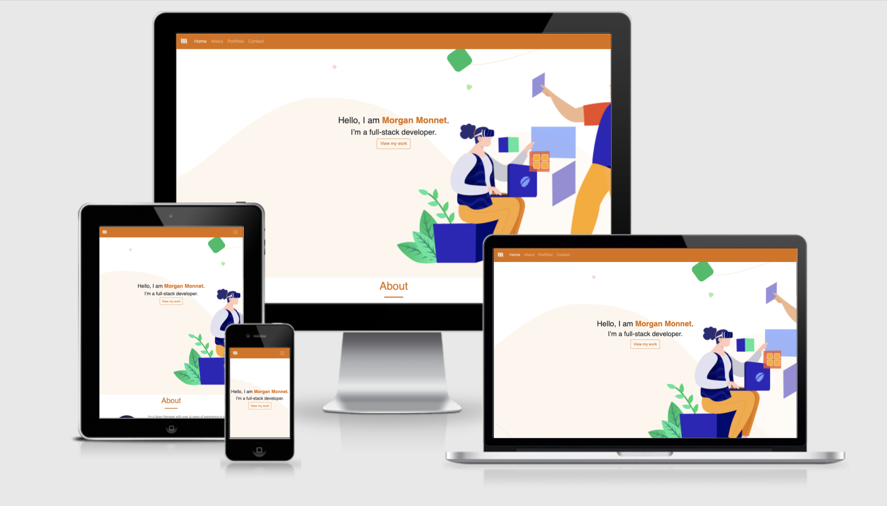

# Morgan Monnet's Personal Portfolio

[View the live project here](https://mpysys.github.io/portfolio-personal/)

## Table of contents
1. [Introduction](#Introduction)
2. [UX](#UX)
    1. [Ideal User Demographic](#Ideal-User-Demographic)
    2. [User Stories](#User-Stories)
    3. [Development Planes](#Development-Planes)
    4. [Design](#Design)
3. [Features](#Features)
    1. [Design Features](#Design-Features) 
    2. [Existing Features](#Existing-Features)
    3. [Features to Implement in the future](#Features-to-Implement-in-the-future)
4. [Issues and Bugs](#Issues-and-Bugs)
5. [Technologies Used](#Technologies-Used)
     1. [Main Languages Used](#Main-Languages-Used)
     2. [Frameworks, Libraries & Programs Used](#Frameworks,-Libraries-&-Programs-Used)
6. [Testing](#Testing)
7. [Deployment](#Deployment)
     1. [Deploying on GitHub Pages](#Deploying-on-GitHub-Pages)
8. [Credits](#Credits)
     1. [Content](#Content)
     2. [Media](#Media)
     3. [Code](#Code)
9. [Acknowledgements](#Acknowledgements)
***

## Introduction

This website has been designed to be the online personal resume & portfolio for Morgan Monnet. The focus of the site is to create an online presence allowing potential employers, as well as developers, to find out relevant information and to get to know Morgan. 

Morgan is a Dublin based sales manager, that currently works at Facebook. With over 12 years of experience in business in the Advertising and Techn industry, Morgan has developed full-stack development skills since 2021. The purpose of the site was to highlight the background, skills and projects that Morgan has acquired over time to provide an additional outlet on top of traditional networks such as LinkedIn for potential employers or the development community.

This is the first of four Milestone Projects that the developer must complete during their Full Stack Web Development Program at The Code Institute. 

The main requirements for this project were to make a responsive and static website with a minimum of three pages using primarily **HTML5** and **CSS3**.

[Back to top ⇧](#Morgan-Monnet's-Personal-Portfolio)

## UX 

### Ideal User Demographic
#### The ideal user of this website is:
- Potential employers
- Recruiters
- Full-stack Developers
- Individuals thinking of a career switch

### User Stories
#### Potential employers & recruiters:
1. As a potential employer, I am looking to get in touch with Morgan but do not have his email address or a way to reach out to him directly.
2. As a potential employer, I would like to see the various work Morgan has done and review his code in his repositories
3. As a potential employer, I would like to reach out to Morgan directly but do not have his email address or phone number.

#### Full-stack developers:
1. As a full-stack developer, I am looking for inspiration on projects and want to see the work that Morgan has done 
2. As a full-stack developer, I would like to look at or re-use code that Morgan might have shared publically.
3. As a full-stack developer,  I would like to get in touch with Morgan to collaborate

#### Individuals thinking of a career switch:
1. As someone thinking of a potential career switch, I am looking for inspiring stories of people that have successfully made that change.
2. As someone thinking of a potential career switch, I am looking to see what kind of projects people with a similar background have done.

### Development Planes

As this is the first of several project milestones, this website was built as a foundation for me to be able to update this along the way of my career journey. This website's goal is to respond to the aforementioned user stories.

#### Strategy
Broken into three categories, the website will focus on the following target audiences:
- **Employers/Recruiters**

- **Developers**

- **Individuals thinking of career change**
 

The website needs to enable the **user** to:
- Retrieve desired information:
     - Professional information
     - Projects
     - Repositories
     - Contact information (PR and social enquires)
     - Find them on their preferred social platform

The website needs to enable  **me** to:
- Develop an online presence 
- Provide an easily navigable website for users to find relevant information:
     - About me
     - Project I have worked on
- Provide a channel of communication for anyone looking to get in touch.

#### Scope
To clearly identify what needed to be done according to the strategy above, I defined what content and functionality needed to be on the website:
- **Content Requirements**
     - The user will be looking for:
          - Information about who I am
          - What skills I bring to the table
          - My past and current projects
          - Contact form
          - Social Links
    
- **Functionality Requirements**
     - The user will be able to:
          - Easily navigate through the site in order to find the information they want
          - Be able to find links to external sites in order to:
               - Look at my projects
               - Learn more about me
          - Contact me directly 

#### Structure
I opted in for a simple one page design split out into **three sections**:
1. about
2. portfolio
3. contact 

#### Wireframe
Wireframe mockups were created in [Figma Workspace](https://www.figma.com/file/VHuG0dpzANFPkke7BNgTX4/Portfolio_Draft) with the aim to be straightforward and modern in design:

### Design

#### Colour Scheme
The main colours used throughout the website are a mixture of Orange and White, with Black accents.

I chose these colors as they are bright and warm. A feeling I want users to have when they browse my personal portfolio.

#### Typography
The pairing of the fonts [Raleway](https://fonts.google.com/specimen/Raleway "Link to Raleway Google Font") and [Roboto](https://fonts.google.com/specimen/Roboto "Link to Roboto Google Font") is used throughout the website with Sans Serif as the fallback font in case of import failure. 

#### Imagery
The selected imagery is artistic and whimsical, helping the user feel light & warm. 
All imagery provides alternative text to be used in the event that the element cannot be rendered. 

[Back to top ⇧](#Morgan-Monnet's-Personal-Portfolio)

## Features

### Design Features
Features of the website are very basic as it features a consistent responsive navigational system:
- The **Header** contains a conventionally placed **logo** in the top left of the page and **navigation bar**. The header is fixed. 
- On smaller screens, the navigation bar collapses into a **toggler** icon whereby clicking it will reveal the navigation and social links.
- The **Footer** contains the appropriate **social media icons**, linking users to the main social pages of Morgan Monnet. 

 
### Existing Features
- **Header Logo** - Appearing on every page for brand recognition.
- **Header Navigation Bar** - Appearing on every page for a consistently easy and intuitive navigable system.
- **Social Icons** - Appearing on every page, the icons are appropriate representations of the Social Media platforms, linking users to Morgan Monnet's page on each. 
- **Repository buttons** - Appearing in the project section to help redirect users to the associated repo.
- **Contact form** - Submit your contact information as well as your query in the contact form.
- **Contact form confirmation page** - A page to confirm that you have sent your message through the contact form successfully

### Features to Implement in the future
- **Blog page**
     - **Feature** - set up a page where I can log my progress and learnings in the form of blog posts
     - **Reason for not featuring in this release** - Currently limited in terms of learning and progress on my journey
 
 - **Resume**
     - **Feature** - have a dedicated page to my resume
     - **Reason for not featuring in this release** - Currently not needed as resume's are not up to date.

[Back to top ⇧](#Morgan-Monnet's-Personal-Portfolio)

## Issues and Bugs 
I ran into various issues during the development of the website. Please find below the noteworthy ones as well as the solutions/ideas that I came up with:

**Navbar Bug** - A bug was detected early on with the Navigation bar. In implementing a responsive navigation system, Bootstrap was used but there was bug that would not allow the navbar to be recolored or to convert into a hamburger menu when on smaller screens. After doing various research on google, I found [Stack Overflow](https://stackoverflow.com/questions/21956741/mobile-bootstrap-navbar-not-working "Link to Stack Overflow solution") with a similar problem where they weren't able to collapse the menu. It was from here that the developer was able to troubleshoot the issue

**About me image responsiveness** - A bug was detected when checking responsiveness the about me image and the text where the text would overlap onto the image. Especially with the various amounts of screen sizes available nowadays. In order to stop this, I started using more containers with values of "inheritence", enabling me to let width and height be dictated by the outer containers as screens get resized.

**Skills** - Two issues in regards to building the skills sections as I wanted to do this on my own, without using Bootstrap:
1. First issue was in regards to making each bar sit on it's own row as I was faced with them overlapping and unable to separate them through the box method. The solution came to me when I realized that the CSS was not unique to each container. When I then created unique classes/ID's for each part of the container, I was able to space each bar out as I wanted.
2. An issue was detected when checking responsiveness as the bars for each skill would not resize appropriately. In order to make that work, I had to change my media queries to reflect "inherited" values. 

**overflow-x** - An issue surfaced when checking the website on small screens where users could scroll horizontally. After some research I found the solution here [Stack Overflow](https://stackoverflow.com/questions/4192277/disable-horizontal-scroll-on-mobile-web "Link to Stack Overflow solution") and implemented the change.

[Back to top ⇧](#Morgan-Monnet's-Personal-Portfolio)

## Technologies Used
### Main Languages Used
- [HTML5](https://en.wikipedia.org/wiki/HTML5 "Link to HTML Wiki")
- [CSS3](https://en.wikipedia.org/wiki/Cascading_Style_Sheets "Link to CSS Wiki")

### Frameworks, Libraries & Programs Used
- [Bootstrap](https://getbootstrap.com/docs/4.4/getting-started/introduction/ "Link to Bootstrap page")
     - Bootstrap was used to implement the responsiveness of the site, using bootstrap classes.
- [Google Fonts](https://fonts.google.com/ "Link to Google Fonts")
    - Google fonts was used to import the fonts "Roboto", "Lato" and "Montserrat" into the style.css file. These fonts were used throughout the project.
- [Font Awesome](https://fontawesome.com/ "Link to FontAwesome")
     - Font Awesome was used on all pages throughout the website to import icons (e.g. social media icons) for UX purposes.
- [Git](https://git-scm.com/ "Link to Git homepage")
     - Git was used for version control by utilizing the GitPod terminal to commit to Git and push to GitHub.
- [GitHub](https://github.com/ "Link to GitHub")
     - GitHub was used to store the project after pushing
- [Figma](https://www.figma.com/ "Link to Figma homepage")
     - Figma was used to create the wireframes during the design phase of the project.
- [Am I Responsive?](http://ami.responsivedesign.is/# "Link to Am I Responsive Homepage")
     - Am I Responsive was used in order to see responsive design throughout the process and to generate mockup imagery to be used.

[Back to top ⇧](#Morgan-Monnet's-Personal-Portfolio)

## Testing

Industry standard Validator results:
- [W3C HTML Validator](https://validator.w3.org/nu/?doc=https%3A%2F%2Fmpysys.github.io%2Fportfolio-personal%2F "Link to W3C HTML Validator")
- [W3C CSS Validator](https://jigsaw.w3.org/css-validator/validator?uri=https%3A%2F%2Fmpysys.github.io%2Fportfolio-personal%2F%23&profile=css3svg&usermedium=all&warning=1&vextwarning=&lang=en "Link to W3C CSS Validator")

I have tested the website on the following browsers:
- [Safari](./assets/readme-files/safari.png "Link to Safari Screenshot")
- [Chrome](./assets/readme-files/chrome.png "Link to Chrome Screenshot")
- [Opera](./assets/readme-files/opera.png "Link to Opera Screenshot")

## Deployment
This project was developed using [Gitpod](https://gitpod.io/ "Link to GitPod site"), committed to git and pushed to GitHub using their browser terminal.

### Deploying on GitHub Pages
To deploy this page to GitHub Pages from its GitHub repository, the following steps were taken:

1. Log into [GitHub](https://github.com/login "Link to GitHub login page") or [create an account](https://github.com/join "Link to GitHub create account page").
2. Locate the [GitHub Repository](https://github.com/mpysys/portfolio-personal "Link to GitHub Repo").
3. At the top of the repository, select Settings from the menu items.
4. Scroll down the Settings page to the "GitHub Pages" section.
5. Under "Source" click the drop-down menu labelled "None" and select "Master Branch".
6. Upon selection, the page will automatically refresh meaning that the website is now deployed.
7. Scroll back down to the "GitHub Pages" section to retrieve the deployed link.
8. At the time of submitting this Milestone project the Development Branch and Master Branch are identical.

[Back to top ⇧](#Morgan-Monnet's-Personal-Portfolio)

## Credits 

### Content
- The structure of the README was inspired by [Kryan Live](https://github.com/rebeccatraceyt/KryanLive/blob/master/README.md)
- The inspiration to make the skills bar comes from [FindMatthew](http://findmatthew.com/)

### Media
- The Template for wireframe AND hero image was thanks to this Figma template here on [Figma](https://www.figma.com/community/file/1019162390459683817)

### Code 
I consulted multiple sites in order to better understand the code I was  trying to implement. The following sites were used on a more regular basis:
- [Stack Overflow](https://stackoverflow.com/ "Link to Stack Overflow page")
- [W3Schools](https://www.w3schools.com/ "Link to W3Schools page")
- [Bootstrap](https://getbootstrap.com/ "Link to BootStrap page")
- [StackEdit](https://stackedit.io "Link to Stackedit page")

[Back to top ⇧](#Morgan-Monnet's-Personal-Portfolio)

## Acknowledgements

- I would like to thank my mentors Seun and Antonio for their valuable feedback and critic during the process of design and development.
- I would like to thank my friends from Brewchachos who have tested and shared great feedback throughout the process.

[Back to top ⇧](#Morgan-Monnet's-Personal-Portfolio)
